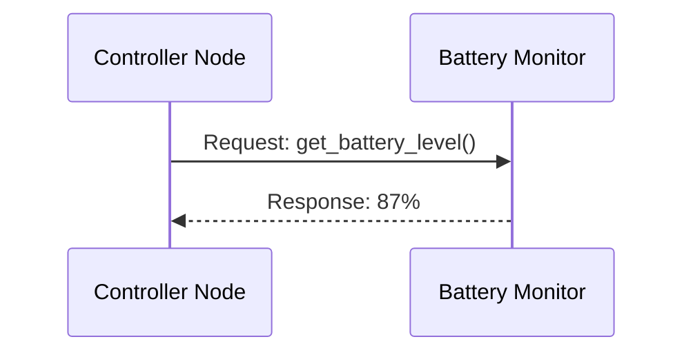
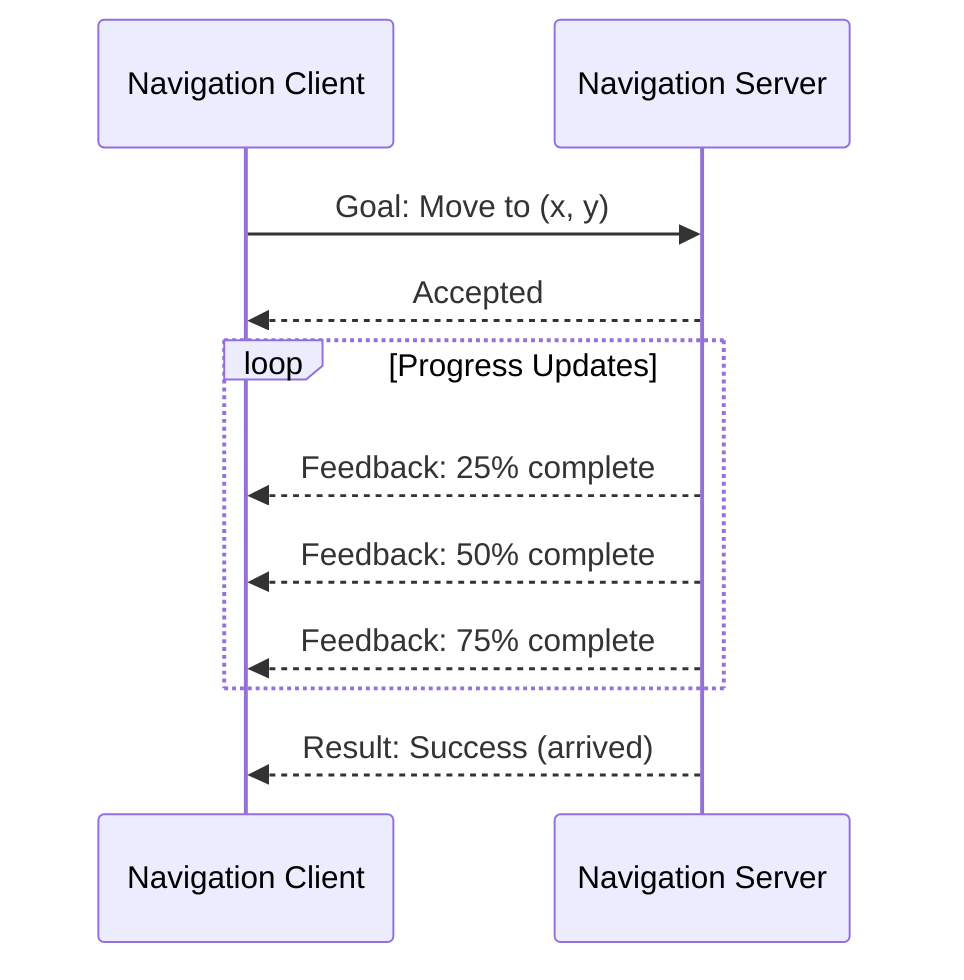
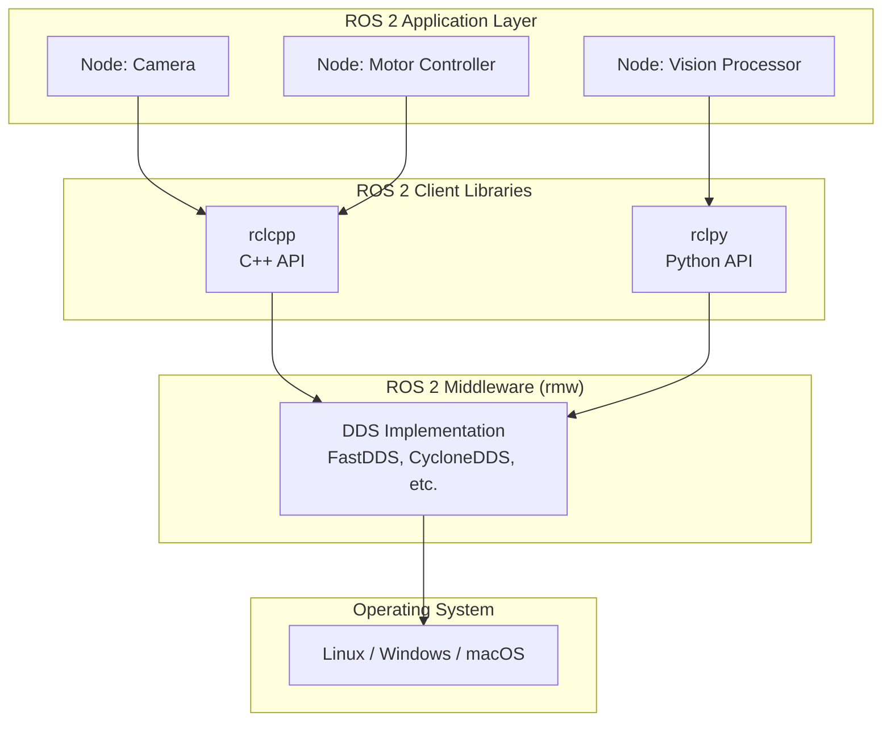
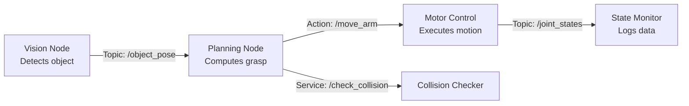

# Chapter 1: Introduction to ROS 2

## Chapter Purpose & Audience

This chapter introduces you to the **Robot Operating System 2 (ROS 2)** framework, its evolution from ROS 1, and its relevance to modern robotics development—particularly for humanoid and physical AI systems.

**Target Audience**: Developers and engineers new to ROS 2 but with basic Linux familiarity.

---

## Learning Objectives

By the end of this chapter, you will be able to:

1. **Understand** the core architecture of ROS 2 and how it differs from ROS 1
2. **Explain** the pub/sub communication model and why it's essential for distributed robotics systems
3. **Identify** the key components of a ROS 2 system (nodes, topics, services, actions)
4. **Recognize** when to use ROS 2 vs. other robotics frameworks for humanoid robotics projects
5. **Navigate** official ROS 2 documentation and community resources effectively

---

## Prerequisites

Before starting this chapter, you should have:
- Basic familiarity with Linux command-line operations
- Understanding of distributed systems concepts (processes, inter-process communication)
- Access to Ubuntu 22.04 (physical machine, VM, or WSL)

:::info
Chapter 2 will guide you through the complete ROS 2 installation process. For now, focus on understanding the concepts.
:::

---

## Key Concepts

### ROS 2 vs. ROS 1

ROS 2 represents a fundamental redesign of the original Robot Operating System (ROS 1), addressing limitations discovered through years of real-world robotics deployments.

**Major Improvements**:

| Feature | ROS 1 | ROS 2 |
|---------|-------|-------|
| **Middleware** | Custom TCPROS/UDPROS | DDS (Data Distribution Service) |
| **Real-time Support** | Limited | Built-in via DDS QoS policies |
| **Security** | Minimal | DDS Security (SROS2) with encryption |
| **Platform Support** | Linux primary | Linux, Windows, macOS, RTOS |
| **Build System** | catkin | ament (CMake + Python) |
| **Communication** | Master-based | Peer-to-peer (no single point of failure) |

:::tip Why DDS Middleware Matters
DDS (Data Distribution Service) is an industry-standard middleware used in aerospace, defense, and medical systems. It provides:
- **Quality of Service (QoS)**: Configure reliability, durability, and performance per-topic
- **Discovery**: Automatic node/topic discovery without a central master
- **Real-time**: Deterministic communication for time-critical robotics tasks
:::

### Nodes: Independent Processes

In ROS 2, a **node** is an independent process that performs a specific task. Examples:
- **Camera node**: Captures images from a camera sensor
- **Planning node**: Computes navigation paths
- **Motor control node**: Sends commands to actuators

**Key Characteristics**:
- Nodes run as separate OS processes
- Each node has a unique name (e.g., `/camera_front`, `/planner`)
- Nodes can be written in C++ (rclcpp) or Python (rclpy)
- Nodes communicate without knowing each other's implementation details

### Communication Patterns

ROS 2 provides three primary communication patterns:

#### 1. Topics (Publish-Subscribe)

**Use Case**: Streaming data (sensor readings, state updates)

- **Asynchronous**: Publishers don't wait for subscribers
- **Many-to-many**: Multiple publishers and subscribers per topic
- **Example**: Camera publishes images to `/camera/image_raw` topic

```mermaid
graph LR
    A[Camera Node] -->|publishes| B[/camera/image_raw<br/>Topic]
    B -->|subscribes| C[Vision Node]
    B -->|subscribes| D[Recording Node]
```

#### 2. Services (Request-Response)

**Use Case**: One-off queries or commands (parameter retrieval, mode switching)

- **Synchronous**: Client waits for server response
- **One-to-one**: Single request, single response
- **Example**: Query robot's current battery level



#### 3. Actions (Long-Running Tasks with Feedback)

**Use Case**: Tasks that take time and provide progress (navigation, manipulation)

- **Asynchronous with feedback**: Client receives periodic updates
- **Preemptable**: Can be cancelled mid-execution
- **Example**: Navigate to a goal position while reporting progress



### Packages and Workspaces

**Package**: A directory containing ROS 2 nodes, launch files, configuration, and dependencies.

**Workspace**: A directory structure that organizes multiple packages:
```
ros2_ws/
├── src/          # Source code (your packages)
├── build/        # Build artifacts (generated)
├── install/      # Installed executables and libraries
└── log/          # Build and runtime logs
```

### Quality of Service (QoS) Policies

QoS policies allow you to configure communication reliability per-topic:

- **Reliability**: `RELIABLE` (guaranteed delivery) vs. `BEST_EFFORT` (UDP-style)
- **Durability**: `TRANSIENT_LOCAL` (store for late joiners) vs. `VOLATILE` (real-time only)
- **History**: Keep last N messages or all messages

**Example**: A laser scan topic might use `BEST_EFFORT` for low latency, while a map topic uses `RELIABLE + TRANSIENT_LOCAL` to ensure new nodes receive the map.

---

## ROS 2 Architecture Overview

The diagram below shows how ROS 2 components interact:



**Explanation**:
1. **Nodes** are written using client libraries (rclcpp for C++, rclpy for Python)
2. **Client libraries** communicate via the ROS 2 middleware (rmw) abstraction
3. **Middleware** uses DDS for actual network communication
4. **DDS** runs on the operating system's network stack

---

## Real-World Humanoid Robotics Scenario

Consider a humanoid robot performing object manipulation:



**Communication Breakdown**:
- **Vision → Planning**: Topic (continuous object pose updates)
- **Planning → Motor Control**: Action (long-running arm movement with feedback)
- **Motor Control → State Monitor**: Topic (streaming joint positions)
- **Planning → Collision Checker**: Service (one-time query: is path safe?)

---

## When to Use Topics, Services, or Actions

| Scenario | Use | Reason |
|----------|-----|--------|
| Streaming sensor data (camera, IMU, lidar) | **Topic** | Continuous data, many subscribers |
| Querying current robot state | **Service** | One-off request, need immediate response |
| Sending a navigation goal | **Action** | Long-running, need progress feedback, may cancel |
| Publishing joint commands to motors | **Topic** | High-frequency control loop |
| Requesting parameter values | **Service** | Synchronous query |
| Executing a pick-and-place sequence | **Action** | Multi-step task with feedback |

---

## The ROS 2 Ecosystem

### Distributions

ROS 2 releases follow a predictable schedule:

- **Humble Hawksbill (2022)**: Long-Term Support (LTS) until 2027, recommended for production
- **Iron Irwini (2023)**: Latest features, supported until 2024
- **Rolling**: Bleeding-edge development, updated continuously

**Recommendation**: Use **Humble** for humanoid robotics projects requiring stability.

### Community and Support

- **Official Documentation**: [docs.ros.org](https://docs.ros.org/en/humble/)
- **Design Documents**: [design.ros2.org](https://design.ros2.org/) (architecture decisions)
- **Community Forum**: [discourse.ros.org](https://discourse.ros.org/)
- **GitHub**: [github.com/ros2](https://github.com/ros2) (source code and issues)

---

## Ubuntu-Specific Commands

These commands will be functional after you complete Chapter 2 (installation):

```bash
# Check ROS 2 installation
ros2 --version

# List available ROS 2 commands
ros2 --help

# View active ROS 2 nodes (once nodes are running)
ros2 node list

# View active topics
ros2 topic list

# Get information about a specific topic
ros2 topic info /camera/image_raw

# Echo messages on a topic (see live data)
ros2 topic echo /camera/image_raw
```

:::note
These commands will return errors until you install ROS 2 in Chapter 2. Bookmark them for reference!
:::

---

## Practice Tasks

Complete these tasks to reinforce your understanding:

### Task 1: ROS 1 vs. ROS 2 Research
**Objective**: Document 3 key differences between ROS 1 and ROS 2 that are relevant to humanoid robotics.

**Deliverable**: Write a 1-page summary comparing:
1. Communication architecture (master-based vs. peer-to-peer)
2. Real-time capabilities (how ROS 2 enables deterministic control)
3. Security features (how ROS 2 protects against unauthorized access)

### Task 2: Documentation Exploration
**Objective**: Navigate the official ROS 2 documentation and locate the installation guide.

**Steps**:
1. Visit [docs.ros.org](https://docs.ros.org/en/humble/)
2. Find the installation guide for Ubuntu 22.04
3. Identify which ROS 2 distribution is LTS (Long-Term Support)
4. Bookmark the "Concepts" page for future reference

### Task 3: Tutorial Video Summary
**Objective**: Watch an introductory ROS 2 tutorial and summarize key takeaways.

**Recommended Video**: Search YouTube for "ROS 2 Humble Tutorial" from the official ROS channel

**Deliverable**: Write 5 bullet points summarizing:
- What problem does ROS 2 solve?
- How does the pub/sub model work?
- What are the basic ROS 2 command-line tools?

---

## Summary

- **ROS 2** is the next generation of ROS, built on **DDS middleware** for improved real-time performance, security, and platform support
- **Core communication patterns**:
  - **Topics**: Pub/sub for streaming data
  - **Services**: Request/response for one-off queries
  - **Actions**: Long-running tasks with feedback and cancellation
- **Nodes** are independent processes that communicate via topics, services, and actions
- **ROS 2 Humble** is the recommended LTS distribution for Ubuntu 22.04
- **Quality of Service (QoS)** policies enable reliable communication in diverse network conditions
- **Use cases**: Vision → Planning → Control is a common pattern in humanoid robotics

:::tip Next Steps
In Chapter 2, you'll install ROS 2 Humble on Ubuntu 22.04 and create your first workspace. The concepts covered here will become hands-on!
:::

---

## References

All references point to official documentation:

1. **ROS 2 Documentation**: https://docs.ros.org/en/humble/
   - Comprehensive guides, tutorials, and API references

2. **ROS 2 Design Overview**: https://design.ros2.org/
   - Architectural decisions and rationale behind ROS 2

3. **ROS 2 Concepts**: https://docs.ros.org/en/humble/Concepts.html
   - Detailed explanations of nodes, topics, services, actions, QoS

4. **DDS Specification**: https://www.omg.org/spec/DDS/
   - Official DDS standard from OMG (for deep dive into middleware)

---

**Ready to install ROS 2?** Continue to [Chapter 2: ROS 2 Setup on Ubuntu 22.04](/docs/module-01-ros2/02-setup) →
