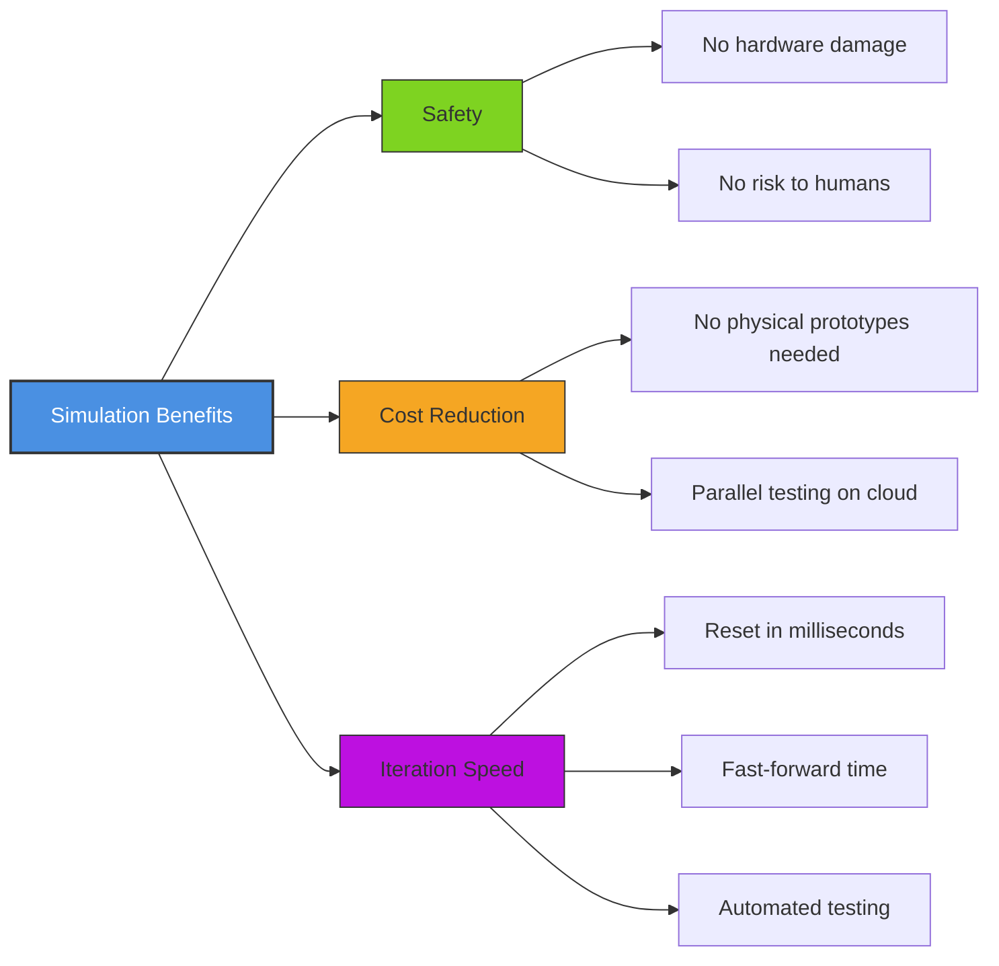
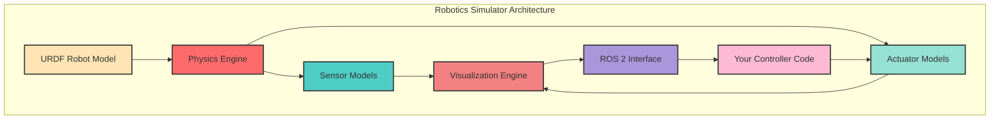
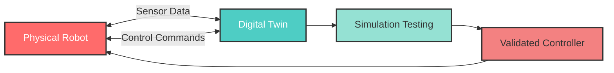
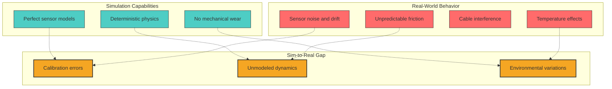

# Chapter 5: Simulation Foundations for Robotics

## Overview

Simulation is the cornerstone of modern robotics development. Before deploying a humanoid robot that costs tens of thousands of dollars, engineers test controllers, perception algorithms, and navigation strategies in virtual environments. This chapter introduces the fundamental concepts of robotics simulation, explains why digital twins are essential for humanoid robotics, and compares different physics engines used in industry-standard simulators.

**Target Audience**: Developers new to robotics simulation who want to understand the role of virtual testing in the development lifecycle.

---

## Learning Objectives

By the end of this chapter, you will be able to:

1. **Understand the purpose and benefits** of simulation in robotics development (safety, cost reduction, iteration speed)
2. **Identify key components** of a robotics simulator (physics engine, sensor models, actuator models, visualization)
3. **Explain the concept of a digital twin** and its role in sim-to-real transfer
4. **Compare different physics engines** (ODE, Bullet, PhysX) and their trade-offs for humanoid robotics
5. **Recognize when to use simulation** vs. real hardware testing for various development scenarios

---

## Why Simulation Matters for Humanoid Robotics

### The Cost of Failure

Imagine testing a bipedal walking controller on a physical humanoid robot without prior validation. A single bug in the balance algorithm could cause the robot to fall, damaging:
- **Hardware**: Motors, sensors, structural components ($5,000-$50,000 repair costs)
- **Safety**: Risk to nearby humans if the robot is heavy or moving at speed
- **Time**: Weeks of downtime for repairs and recalibration

Simulation eliminates these risks by providing a **safe sandbox** where failures are cheap, reversible, and informative.

### Three Core Benefits



1. **Safety**: Test dangerous scenarios (falling, collisions, edge cases) without risking physical damage
2. **Cost Reduction**: Generate thousands of training scenarios without manufacturing physical test environments
3. **Iteration Speed**: Reset the simulation in seconds vs. hours of hardware setup and recalibration

---

## Key Components of a Robotics Simulator

A complete robotics simulator consists of four interconnected systems:



### 1. Physics Engine

The **physics engine** simulates rigid body dynamics, collision detection, and contact forces. It answers questions like:
- "If the robot's foot applies 50N of force at this angle, will it slip?"
- "What happens when two links collide during a rapid arm swing?"

**Common Physics Engines**:
- **ODE (Open Dynamics Engine)**: Default in Gazebo, good general-purpose performance
- **Bullet**: Fast collision detection, used in gaming and robotics
- **PhysX (NVIDIA)**: GPU-accelerated, highly accurate for complex interactions

### 2. Sensor Models

**Sensor models** simulate real-world sensors with realistic noise, latency, and field-of-view constraints:
- **Cameras**: RGB, depth (Kinect-style), fisheye distortion
- **LiDAR**: 2D/3D point clouds with ray tracing
- **IMU (Inertial Measurement Unit)**: Accelerometer and gyroscope data with drift
- **Force/Torque Sensors**: Contact forces at joints (e.g., foot pressure for balance control)

**Example**: A simulated camera might add Gaussian noise to mimic real sensor imperfections:

```python
# Simulated camera with noise
import numpy as np

def simulate_camera_image(perfect_image):
    """Add realistic noise to simulated camera output"""
    noise = np.random.normal(0, 5, perfect_image.shape)  # Mean=0, StdDev=5
    noisy_image = np.clip(perfect_image + noise, 0, 255)
    return noisy_image.astype(np.uint8)
```

### 3. Actuator Models

**Actuator models** simulate motors and servos, including:
- **Torque limits**: Motors can't apply infinite force
- **Velocity limits**: Maximum joint rotation speed
- **Control latency**: Delay between command and execution (10-50ms typical)
- **Gear backlash**: Mechanical play in joints

**Example**: A position controller with velocity limits:

```python
# Simplified actuator model
class JointActuator:
    def __init__(self, max_velocity=2.0):  # rad/s
        self.current_position = 0.0
        self.max_velocity = max_velocity

    def move_to(self, target_position, dt):
        """Move toward target with velocity constraints"""
        error = target_position - self.current_position
        step = np.clip(error, -self.max_velocity * dt, self.max_velocity * dt)
        self.current_position += step
        return self.current_position
```

### 4. Visualization Engine

The **visualization engine** renders the simulation for human observation:
- **3D Graphics**: Meshes, textures, lighting (often OpenGL-based)
- **Sensor Overlays**: Camera feeds, LiDAR point clouds
- **Debug Visualizations**: Force vectors, joint axes, collision shapes

---

## Digital Twin: Bridging Simulation and Reality

### Definition

A **digital twin** is a virtual replica of a physical robot that mirrors its behavior, sensors, and environment. It serves as a **bidirectional bridge** between simulation and reality:



### Workflow Example: Validating a Walking Gait

1. **Design in Simulation**: Create a bipedal walking controller in the digital twin
2. **Test Edge Cases**: Simulate uneven terrain, sudden pushes, sensor failures
3. **Collect Data**: Log joint angles, forces, IMU readings from 10,000 simulated steps
4. **Transfer to Hardware**: Deploy the controller to the physical robot
5. **Compare Behavior**: Stream real sensor data back to the digital twin to identify discrepancies
6. **Iterate**: Refine the controller based on real-world observations, re-test in simulation

### Real-World Use Case: Boston Dynamics Spot

Boston Dynamics uses simulation extensively before deploying Spot robots:
- **Pre-deployment**: Test navigation algorithms in simulated factories, construction sites, and oil rigs
- **Edge Case Discovery**: Simulate rare events (e.g., slippery metal grates, sudden obstacles)
- **Scalability**: Run 100 parallel simulations on cloud servers to test parameter variations

---

## Physics Engines Compared: ODE vs. Bullet vs. PhysX

Different physics engines make trade-offs between **speed**, **accuracy**, and **feature support**. Here's a comparison for humanoid robotics:

| Feature | ODE (Open Dynamics Engine) | Bullet | PhysX (NVIDIA) |
|---------|----------------------------|--------|----------------|
| **Speed** | Moderate (CPU-only) | Fast (optimized collision detection) | Very Fast (GPU acceleration) |
| **Accuracy** | Good for rigid bodies | Good, with soft body support | Excellent (high-fidelity contact) |
| **Contact Handling** | Stable for static contacts | Advanced friction models | Best for complex interactions |
| **Soft Bodies** | Limited | Supported | Supported (GPU-accelerated) |
| **Integration** | Default in Gazebo Classic | Supported in PyBullet, Gazebo | Isaac Sim, Omniverse |
| **Best For** | General-purpose robotics | Fast prototyping, RL training | High-fidelity humanoid balance |
| **License** | LGPL/BSD | Zlib (permissive) | Proprietary (free for research) |

### When to Choose Each Engine

**Use ODE if**:
- You're using Gazebo Classic (default choice)
- You need stable, well-documented behavior for wheeled/legged robots

**Use Bullet if**:
- You're training reinforcement learning policies (PyBullet is popular in ML)
- You need fast simulation for thousands of parallel environments

**Use PhysX if**:
- You're working with NVIDIA Isaac Sim or Omniverse
- You need GPU acceleration for real-time, high-fidelity simulation
- Your robot has complex contact scenarios (e.g., humanoid manipulation)

---

## Sim-to-Real Gap: When Simulation Differs from Reality

No simulation is perfect. The **sim-to-real gap** refers to differences between simulated and real-world behavior:



### Common Sources of Sim-to-Real Gap

1. **Friction Models**: Simulations use simplified Coulomb friction, but real surfaces have complex, speed-dependent friction
2. **Sensor Noise**: Simulated noise is often Gaussian, but real sensors have bias drift and outliers
3. **Mechanical Compliance**: Real robot joints have flexibility and backlash not captured in rigid body models
4. **Latency**: Simulation often assumes instant command execution, but real systems have 10-50ms delays
5. **Environmental Variations**: Lighting changes, wind, temperature affect real robots but are hard to model

### Mitigation Strategies

**Domain Randomization**: Vary simulation parameters (friction, mass, sensor noise) to train robust controllers
```python
# Domain randomization example
import random

def randomize_environment():
    friction = random.uniform(0.5, 1.5)  # ±50% variation
    mass_scale = random.uniform(0.9, 1.1)  # ±10% uncertainty
    sensor_noise_std = random.uniform(0.01, 0.05)  # Variable noise
    return friction, mass_scale, sensor_noise_std
```

**System Identification**: Measure real robot parameters (inertia, friction) and update the simulation model

**Iterative Transfer**: Test in simulation → deploy to hardware → collect real data → refine simulation → repeat

---

## When to Use Simulation vs. Real Hardware

| Scenario | Simulation | Real Hardware |
|----------|------------|---------------|
| **Early-stage algorithm development** | ✅ Ideal | ❌ Premature |
| **Testing dangerous edge cases** (falls, collisions) | ✅ Safe and repeatable | ❌ Risk of damage |
| **Generating training data** (1000s of scenarios) | ✅ Scalable and cheap | ❌ Time-intensive |
| **Testing sensor integration** (cameras, LiDAR) | ⚠️ Approximate | ✅ Ground truth |
| **Validating final performance** (latency, reliability) | ❌ Cannot fully replicate reality | ✅ Essential |
| **Debugging mechanical issues** (cable routing, heat) | ❌ Not modeled | ✅ Required |

**Best Practice**: Use simulation for rapid iteration and safety-critical testing, then validate on hardware for final deployment.

---

## Practice Tasks

Complete these exercises to apply simulation concepts:

### **Task 1: Research a Real-World Simulation Use Case**
**Objective**: Find one published robotics project that used simulation during development.

**Deliverables**:
- Project name and reference (e.g., paper, blog post, company case study)
- Summary of what was tested in simulation (gait, manipulation, navigation)
- Reported benefits (time saved, failures prevented, data generated)

**Example**: Research Boston Dynamics Atlas or Agility Robotics Digit development process.

---

### **Task 2: Identify Simulation-Suitable Scenarios**
**Objective**: List 3 scenarios where simulation is safer or more cost-effective than hardware testing for humanoid robots.

**Deliverables**:
- 3 specific scenarios (e.g., "testing emergency stop during high-speed running")
- Explanation of why hardware testing would be risky or expensive
- What simulation can validate vs. what requires hardware confirmation

**Example Scenario**:
- **Scenario**: Testing humanoid response to unexpected obstacles during stair climbing
- **Why Simulation**: No risk of robot falling down stairs and breaking $30k in hardware
- **Validation**: Confirm the controller can recover from perturbations; hardware test needed to verify foot slip on real stair materials

---

### **Task 3: Compare Physics Engines**
**Objective**: Compare ODE and Bullet for humanoid balance control.

**Deliverables**:
- Feature comparison table (contact stability, speed, soft body support)
- Recommendation: Which engine is better for simulating humanoid standing balance?
- Justification: Why did you choose that engine? (Consider contact handling, speed, accuracy)

**Hint**: Research PyBullet examples and Gazebo's ODE performance for bipedal robots.

---

## Summary

- **Simulation enables safe, cost-effective, and rapid robotics development** by eliminating risks of hardware damage
- **Digital twins are virtual replicas** of physical robots used for testing, validation, and iterative controller development
- **Key simulator components**: Physics engine (dynamics), sensor models (cameras, LiDAR, IMU), actuator models (motors with limits), visualization (3D rendering)
- **Physics engines** (ODE, Bullet, PhysX) vary in speed, accuracy, and features:
  - **ODE**: Stable, general-purpose (Gazebo default)
  - **Bullet**: Fast, good for RL training (PyBullet)
  - **PhysX**: High-fidelity, GPU-accelerated (Isaac Sim)
- **Sim-to-real gap**: Simulations approximate reality but differ in friction, sensor noise, latency, and mechanical compliance
  - Mitigate with domain randomization, system identification, and iterative transfer
- **Use simulation for** early development, dangerous scenarios, and scalable data generation
- **Use hardware for** final validation, sensor integration testing, and debugging mechanical issues

---

## References

- Gazebo Overview. (2024). *Gazebo Documentation*. Retrieved from https://gazebosim.org/docs
- Open Robotics. (2024). *ROS 2 Simulation Best Practices*. Retrieved from https://docs.ros.org/en/humble/Tutorials/Advanced/Simulators.html
- NVIDIA. (2024). *Isaac Sim Documentation*. Retrieved from https://docs.omniverse.nvidia.com/isaacsim/latest/index.html
- Coumans, E., & Bai, Y. (2016–2024). *PyBullet Quickstart Guide*. Retrieved from https://pybullet.org/

---

**Next Chapter**: [Chapter 6: Gazebo Simulation for Humanoid Robots](06-gazebo.mdx) - Learn how to integrate ROS 2 with Gazebo, spawn URDF models, and configure sensor plugins for humanoid robots.
