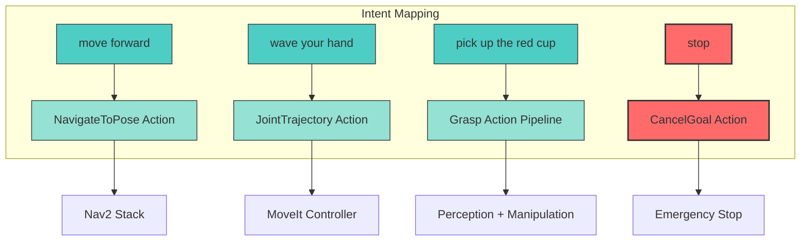
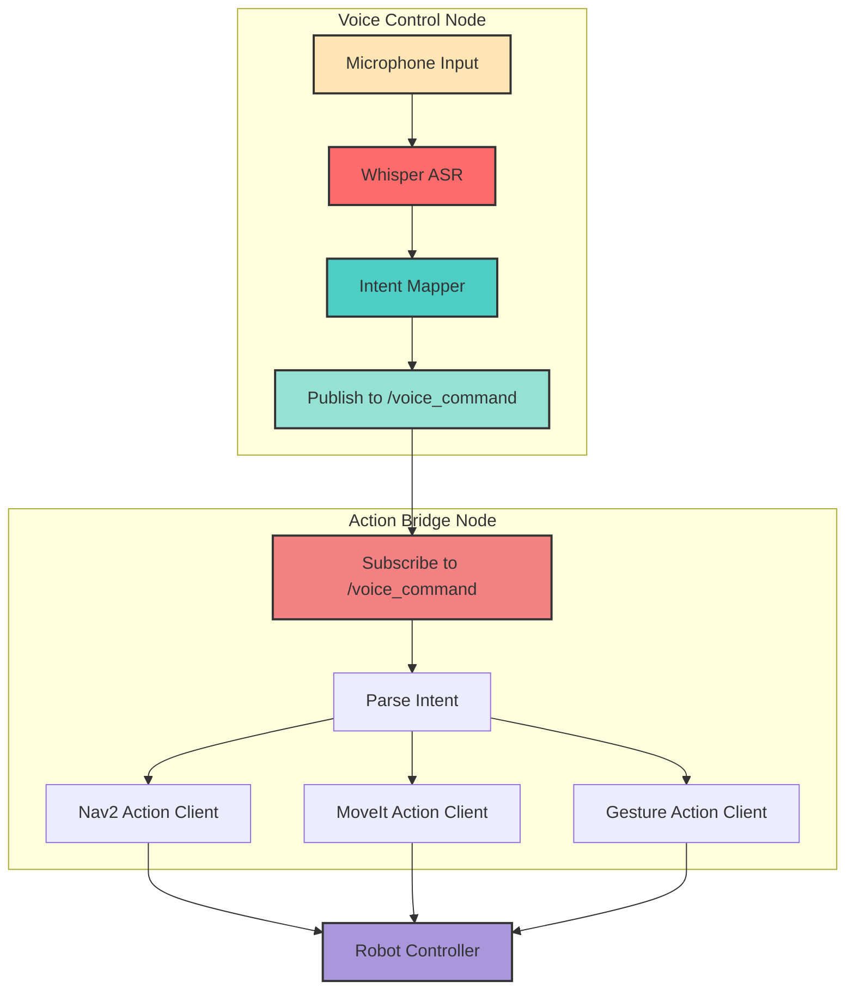
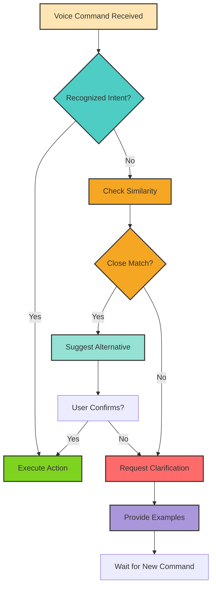

# Chapter 11: Voice-to-Action for Humanoid Robots

## Overview

Imagine commanding a humanoid robot with natural language: "Move to the kitchen," "Wave hello," or "Pick up the red cup." Voice-to-action systems make this possible by converting spoken language into executable robot actions. This chapter introduces the complete pipeline—from audio capture to action execution—and demonstrates how to integrate speech recognition tools like OpenAI Whisper with ROS 2.

**Target Audience**: Developers integrating conversational AI with robotic systems for hands-free control, accessibility, or human-robot collaboration.

---

## Learning Objectives

By the end of this chapter, you will be able to:

1. **Understand the voice-to-action pipeline**: Speech recognition → NLU → intent mapping → robot action execution
2. **Integrate speech recognition tools** (Whisper, Google Speech API) with ROS 2 nodes
3. **Map natural language commands** to robot-specific actions (navigation, manipulation, gestures)
4. **Handle ambiguous or out-of-scope commands** gracefully with fallback responses
5. **Test voice-to-action workflows** in simulation (Isaac Sim or Gazebo) before hardware deployment

---

## The Voice-to-Action Pipeline

Voice-to-action systems consist of four stages:

```mermaid
graph LR
    A[Microphone] --> B[ASR: Speech Recognition]
    B --> C[NLU: Text Analysis]
    C --> D[Intent Mapping]
    D --> E[Action Server]
    E --> F[Robot Controller]
    F --> G[Physical Action]

    B -->|"move forward"| C
    C -->|Intent: Navigate| D
    D -->|Nav2 Goal| E

    style A fill:#FFE5B4,stroke:#333,stroke-width:2px
    style B fill:#FF6B6B,stroke:#333,stroke-width:2px
    style C fill:#4ECDC4,stroke:#333,stroke-width:2px
    style D fill:#95E1D3,stroke:#333,stroke-width:2px
    style E fill:#F38181,stroke:#333,stroke-width:2px
    style F fill:#AA96DA,stroke:#333,stroke-width:2px
    style G fill:#FCBAD3,stroke:#333,stroke-width:2px
```



### **Stage 1: Automatic Speech Recognition (ASR)**

Convert audio input to text transcription using tools like:
- **OpenAI Whisper**: Offline, multilingual, robust to accents and noise
- **Google Cloud Speech-to-Text**: Cloud-based, real-time streaming
- **Mozilla DeepSpeech**: Open-source, privacy-preserving

**Example**: Audio "move forward two meters" → Text `"move forward two meters"`

### **Stage 2: Natural Language Understanding (NLU)**

Parse the transcribed text to extract intent and parameters:
- **Intent**: What action does the user want? (navigate, manipulate, gesture)
- **Parameters**: Specifics like distance, object name, direction

**Example**: `"move forward two meters"` → Intent: `NAVIGATE`, Params: `{direction: forward, distance: 2m}`

### **Stage 3: Intent Mapping**

Translate intents into robot-specific action calls:



### **Stage 4: Action Execution**

Execute the mapped action using ROS 2 action servers:
- **Navigation**: `nav2_msgs/action/NavigateToPose`
- **Manipulation**: `moveit_msgs/action/MoveGroup`
- **Gestures**: `control_msgs/action/FollowJointTrajectory`

---

## Speech Recognition with OpenAI Whisper

**Whisper** is a robust, multilingual speech recognition model from OpenAI that works offline and handles noisy environments well.

### **Installation**

```bash
# Install Whisper
pip install openai-whisper

# Install audio recording tool (ALSA utilities)
sudo apt install alsa-utils

# Verify microphone is detected
arecord -l
```

### **Recording and Transcribing Audio**

```bash
# Record 5 seconds of audio
arecord -d 5 -f cd -t wav command.wav

# Transcribe using Whisper (base model)
whisper command.wav --model base --language English

# Output: command.txt with transcription
```

**Example Output**:
```
[00:00.000 --> 00:03.000] Move forward two meters.
```

### **Python Integration**

```python
import whisper

# Load Whisper model
model = whisper.load_model("base")

# Transcribe audio file
result = model.transcribe("command.wav")

# Extract text
command_text = result["text"]
print(f"Transcription: {command_text}")
# Output: "Move forward two meters."
```

---

## Intent Mapping: From Text to Robot Actions

Intent mapping translates natural language into structured action calls.

### **Simple Rule-Based Mapping**

```python
import re

def map_intent(command_text):
    """Map voice command to ROS 2 action intent."""
    command = command_text.lower()

    # Navigation intents
    if "move forward" in command or "go forward" in command:
        # Extract distance if mentioned
        match = re.search(r"(\d+\.?\d*)\s*(meter|m)", command)
        distance = float(match.group(1)) if match else 1.0
        return {
            "action_type": "navigate",
            "params": {"direction": "forward", "distance": distance}
        }

    elif "move backward" in command:
        match = re.search(r"(\d+\.?\d*)\s*(meter|m)", command)
        distance = float(match.group(1)) if match else 1.0
        return {
            "action_type": "navigate",
            "params": {"direction": "backward", "distance": distance}
        }

    # Gesture intents
    elif "wave" in command:
        return {
            "action_type": "gesture",
            "params": {"gesture_name": "wave"}
        }

    # Manipulation intents
    elif "pick up" in command or "grab" in command:
        # Extract object (simple noun extraction)
        match = re.search(r"(pick up|grab) (?:the )?(\w+)", command)
        object_name = match.group(2) if match else "object"
        return {
            "action_type": "manipulation",
            "params": {"action": "grasp", "object": object_name}
        }

    # Stop/cancel intent
    elif "stop" in command or "cancel" in command:
        return {
            "action_type": "cancel",
            "params": {}
        }

    # Unrecognized command
    else:
        return {
            "action_type": "unknown",
            "params": {"original_text": command}
        }

# Test examples
print(map_intent("Move forward two meters"))
# {'action_type': 'navigate', 'params': {'direction': 'forward', 'distance': 2.0}}

print(map_intent("Wave your hand"))
# {'action_type': 'gesture', 'params': {'gesture_name': 'wave'}}

print(map_intent("Pick up the red cup"))
# {'action_type': 'manipulation', 'params': {'action': 'grasp', 'object': 'red'}}
```

### **Advanced: Using LLMs for Intent Extraction**

For more flexible intent mapping, use a language model (covered in Chapter 12):

```python
# Pseudocode using OpenAI API (Chapter 12 will detail this)
def map_intent_with_llm(command_text):
    prompt = f"""
    Extract the robot action intent from this command: "{command_text}"
    Return JSON with: action_type, parameters
    Valid action_types: navigate, gesture, manipulation, cancel
    """
    response = llm_api.complete(prompt)
    return json.loads(response)
```

---

## ROS 2 Integration

Integrate voice commands with ROS 2 using topics and action clients.

### **Architecture**



### **Voice Control Node (Publisher)**

```python
#!/usr/bin/env python3
import rclpy
from rclpy.node import Node
from std_msgs.msg import String
import whisper
import pyaudio
import wave

class VoiceControlNode(Node):
    def __init__(self):
        super().__init__('voice_control_node')
        self.publisher = self.create_publisher(String, '/voice_command', 10)
        self.model = whisper.load_model("base")
        self.get_logger().info("Voice Control Node started. Press Ctrl+C to stop.")

    def record_audio(self, duration=5):
        """Record audio from microphone."""
        CHUNK = 1024
        FORMAT = pyaudio.paInt16
        CHANNELS = 1
        RATE = 16000

        p = pyaudio.PyAudio()
        stream = p.open(format=FORMAT, channels=CHANNELS, rate=RATE,
                        input=True, frames_per_buffer=CHUNK)

        self.get_logger().info("Recording...")
        frames = []
        for _ in range(0, int(RATE / CHUNK * duration)):
            data = stream.read(CHUNK)
            frames.append(data)

        stream.stop_stream()
        stream.close()
        p.terminate()

        # Save to WAV file
        wf = wave.open("temp_command.wav", 'wb')
        wf.setnchannels(CHANNELS)
        wf.setsampwidth(p.get_sample_size(FORMAT))
        wf.setframerate(RATE)
        wf.writeframes(b''.join(frames))
        wf.close()

        return "temp_command.wav"

    def transcribe_and_publish(self):
        """Record, transcribe, and publish voice command."""
        audio_file = self.record_audio(duration=5)
        result = self.model.transcribe(audio_file)
        command_text = result["text"].strip()

        self.get_logger().info(f"Transcription: {command_text}")

        # Publish to topic
        msg = String()
        msg.data = command_text
        self.publisher.publish(msg)
        self.get_logger().info(f"Published: {command_text}")

def main(args=None):
    rclpy.init(args=args)
    node = VoiceControlNode()

    try:
        while rclpy.ok():
            node.transcribe_and_publish()
            rclpy.spin_once(node, timeout_sec=0.1)
    except KeyboardInterrupt:
        pass

    node.destroy_node()
    rclpy.shutdown()

if __name__ == '__main__':
    main()
```

### **Action Bridge Node (Subscriber + Action Client)**

```python
#!/usr/bin/env python3
import rclpy
from rclpy.node import Node
from rclpy.action import ActionClient
from std_msgs.msg import String
from nav2_msgs.action import NavigateToPose
from geometry_msgs.msg import PoseStamped
import re

class ActionBridgeNode(Node):
    def __init__(self):
        super().__init__('action_bridge_node')
        self.subscription = self.create_subscription(
            String, '/voice_command', self.command_callback, 10)
        self.nav_client = ActionClient(self, NavigateToPose, '/navigate_to_pose')
        self.get_logger().info("Action Bridge Node started.")

    def command_callback(self, msg):
        """Parse voice command and execute action."""
        command = msg.data.lower()
        self.get_logger().info(f"Received command: {command}")

        if "move forward" in command:
            # Extract distance
            match = re.search(r"(\d+\.?\d*)\s*(meter|m)", command)
            distance = float(match.group(1)) if match else 2.0
            self.send_navigation_goal(distance, 0.0)

        elif "stop" in command or "cancel" in command:
            self.nav_client.cancel_all_goals()
            self.get_logger().info("Cancelled all navigation goals.")

        else:
            self.get_logger().warn(f"Unrecognized command: {command}")

    def send_navigation_goal(self, x, y):
        """Send navigation goal to Nav2."""
        goal_msg = NavigateToPose.Goal()
        goal_msg.pose = PoseStamped()
        goal_msg.pose.header.frame_id = 'map'
        goal_msg.pose.pose.position.x = x
        goal_msg.pose.pose.position.y = y
        goal_msg.pose.pose.orientation.w = 1.0

        self.get_logger().info(f"Sending navigation goal: x={x}, y={y}")
        self.nav_client.wait_for_server()
        self.nav_client.send_goal_async(goal_msg)

def main(args=None):
    rclpy.init(args=args)
    node = ActionBridgeNode()
    rclpy.spin(node)
    node.destroy_node()
    rclpy.shutdown()

if __name__ == '__main__':
    main()
```

---

## Error Handling: Graceful Failure

Voice systems must handle unrecognized or ambiguous commands gracefully.



### **Implementation Example**

```python
def handle_command_with_fallback(command_text):
    """Handle voice command with error handling."""
    intent = map_intent(command_text)

    if intent["action_type"] == "unknown":
        # Check for similar commands (fuzzy matching)
        suggestions = get_similar_commands(command_text)
        if suggestions:
            return {
                "status": "clarification_needed",
                "message": f"Did you mean: {', '.join(suggestions)}?",
                "suggestions": suggestions
            }
        else:
            return {
                "status": "error",
                "message": "I didn't understand that command. Try: 'move forward', 'wave', or 'pick up [object]'",
                "examples": ["move forward 2 meters", "wave your hand", "pick up the cup"]
            }

    # Valid intent - execute action
    return {
        "status": "success",
        "intent": intent
    }

def get_similar_commands(command_text):
    """Find similar valid commands using fuzzy matching."""
    from difflib import get_close_matches
    valid_commands = [
        "move forward", "move backward", "turn left", "turn right",
        "wave", "pick up", "stop", "cancel"
    ]
    matches = get_close_matches(command_text, valid_commands, n=2, cutoff=0.6)
    return matches
```

### **Out-of-Scope Command Handling**

```python
# Example: User says "Do a backflip"
command = "do a backflip"
intent = map_intent(command)

if intent["action_type"] == "unknown":
    response = handle_command_with_fallback(command)
    print(response["message"])
    # Output: "I didn't understand that command. Try: 'move forward', 'wave', or 'pick up [object]'"
```

---

## Testing Voice-to-Action in Simulation

Before deploying to hardware, test voice workflows in Isaac Sim or Gazebo.

### **Testing Workflow**

1. **Launch Simulation**: Start Isaac Sim or Gazebo with humanoid robot
2. **Start Voice Node**: Run `voice_control_node` to capture audio
3. **Start Action Bridge**: Run `action_bridge_node` to process commands
4. **Issue Voice Command**: Speak "move forward 3 meters"
5. **Observe Behavior**: Verify robot navigates correctly in simulation
6. **Test Edge Cases**: Try ambiguous commands, background noise, rapid commands

### **Simulation Testing Commands**

```bash
# Terminal 1: Launch Gazebo with humanoid robot
ros2 launch my_humanoid_gazebo simulation.launch.py

# Terminal 2: Start voice control node
ros2 run my_voice_control voice_control_node

# Terminal 3: Start action bridge
ros2 run my_voice_control action_bridge_node

# Terminal 4: Monitor voice commands (optional)
ros2 topic echo /voice_command

# Speak into microphone: "Move forward 2 meters"
# Watch robot navigate in Gazebo
```

---

## Practice Tasks

Complete these exercises to master voice-to-action systems:

### **Task 1: Install and Test Whisper**
**Objective**: Verify speech recognition works on your system.

**Deliverables**:
- Install OpenAI Whisper: `pip install openai-whisper`
- Record 5 seconds of audio: `arecord -d 5 -f cd -t wav test.wav`
- Transcribe audio: `whisper test.wav --model base`
- Verify transcription accuracy (should match your spoken words)

**Example**: Record yourself saying "Move forward two meters" and verify Whisper transcribes correctly.

---

### **Task 2: Create Intent Mapping Node**
**Objective**: Build a ROS 2 node that maps voice commands to navigation goals.

**Deliverables**:
- ROS 2 node subscribing to `/voice_command` topic
- Intent mapper function supporting at least 3 commands:
  - "move forward [X] meters" → `NavigateToPose` action
  - "move backward [X] meters" → `NavigateToPose` action
  - "stop" → Cancel all goals
- Publish navigation goals to Nav2 action server
- Test with `ros2 topic pub /voice_command std_msgs/msg/String "data: 'move forward 3 meters'"`

---

### **Task 3: End-to-End Simulation Test**
**Objective**: Test the complete voice-to-action pipeline in simulation.

**Deliverables**:
- Launch Gazebo or Isaac Sim with a humanoid robot
- Run voice control node (Whisper + publisher)
- Run action bridge node (subscriber + Nav2 client)
- Successfully navigate robot using voice commands:
  - "Move forward 2 meters"
  - "Turn left"
  - "Stop"
- Record a video or screenshot showing robot responding to voice commands

---

### **Task 4: Implement Error Handling**
**Objective**: Add graceful error handling for unrecognized commands.

**Deliverables**:
- Modify intent mapper to detect unknown commands
- Return helpful error messages with examples
- Test with out-of-scope commands:
  - "Do a backflip" → "I can't perform that action. Try: move forward, wave, pick up"
  - "Fly to the moon" → Suggest similar valid commands
- Log all unrecognized commands for future training data

---

## Summary

- **Voice-to-action enables natural, hands-free interaction** with humanoid robots for accessibility and collaboration
- **Pipeline**: ASR (Whisper, Google Speech) → NLU (intent parsing) → Intent Mapping → ROS 2 Action Execution
- **Speech recognition tools** like Whisper convert audio to text transcriptions offline and robustly
- **Intent mapping** translates natural language to robot-specific actions:
  - Navigation: "move forward" → `NavigateToPose`
  - Gestures: "wave" → `FollowJointTrajectory`
  - Manipulation: "pick up the cup" → Grasp action pipeline
- **Error handling is critical** for ambiguous or out-of-scope commands:
  - Fallback responses: "I didn't understand"
  - Suggestions: "Did you mean: move forward?"
  - Examples: "Try: move forward, wave, pick up"
- **ROS 2 integration** uses topics (`/voice_command`) and action clients (Nav2, MoveIt) for command execution
- **Simulation testing** (Gazebo, Isaac Sim) validates voice workflows before hardware deployment

---

## References

- OpenAI. (2024). *Whisper: Robust Speech Recognition*. Retrieved from https://github.com/openai/whisper
- Open Robotics. (2024). *ROS 2 Actions Tutorial*. Retrieved from https://docs.ros.org/en/humble/Tutorials/Beginner-CLI-Tools/Understanding-ROS2-Actions/Understanding-ROS2-Actions.html
- Navigation2. (2024). *Nav2 Actions Documentation*. Retrieved from https://navigation.ros.org/
- Google Cloud. (2024). *Speech-to-Text API*. Retrieved from https://cloud.google.com/speech-to-text

---

**Next Chapter**: [Chapter 12: LLM-Based Planning](12-llm-planning.mdx) - Learn how to use GPT-4 and Claude for high-level task planning and tool use in robotics.
